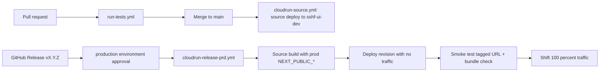

# CI/CD and Deployment Guide

This document describes the path code takes from a developer's branch to
production for **sshf-ui**, what must be configured per environment, how a
release is built into production, and how to verify and roll back. It is
written for both developers and administrators.

## Environments

| | Development | Production |
|---|---|---|
| GCP project | `sshf-ui-dev` | `sshf-ui-prd` |
| Service URL | https://sshf-ui-593951006010.us-central1.run.app | https://sshf-ui-824787296892.us-central1.run.app |
| Cloud Run service | `sshf-ui` (us-central1) | `sshf-ui` (us-central1) |
| Runtime service account | `sshf-ui@sshf-ui-dev.iam.gserviceaccount.com` | `sshf-ui-acc-prd@sshf-ui-prd.iam.gserviceaccount.com` |
| Deploy service account | (dev SA / WIF via sshf-api-dev pool) | `github-service-account@sshf-ui-prd.iam.gserviceaccount.com` |
| Deployed by | Merge to `main` | Published GitHub Release (with approval) |
| Client build config | Repo Actions **variables** | `production` environment **variables** |
| Runtime secret | `sshf-ui-google-client-secret-dev` | `sshf-ui-google-client-secret-prd` |

Both services are publicly invokable; authentication happens inside the
application (Google OAuth popup → Next.js `/api/auth/*` token exchange → API
bearer token). Workspace group membership is enforced by the API
(`ALLOWED_GROUP_EMAILS` on data routes). The UI also gates the app shell with
`NEXT_PUBLIC_ROLE_FULL_ACCESS` after sign-in (defense in depth).

## Critical difference from sshf-api

sshf-api builds once in dev and promotes the exact image digest to production.
**sshf-ui cannot do that.** Next.js inlines `NEXT_PUBLIC_*` into the client
bundle at `next build` time, so an image built with development values will
always talk to the development API.

Production therefore **source-builds the tagged commit** into `sshf-ui-prd`
with production build variables. You lose binary-identical promotion; you keep
versioned releases, an approval gate, and environment isolation.



Workflows involved (all in `.github/workflows/`):

| Workflow | Trigger | What it does |
|---|---|---|
| `run-tests.yml` | Pull request to `main` | Installs dependencies and runs Jest |
| `cloudrun-source.yml` | PR merged to `main` (or manual dispatch) | Source-deploys to dev Cloud Run with dev build vars |
| `cloudrun-release-prd.yml` | GitHub Release published (or manual dispatch) | Source-deploys the tagged commit to prod behind approval |

## Client build variables

These four values are **public** (they ship in the browser bundle). They are
**not** stored in Secret Manager. CI reads them from GitHub Actions variables
and writes them to `.env.production` / `--update-build-env-vars` before the
Cloud Run source build. `scripts/check-build-env.mjs` fails the workflow if
any are missing.

| Variable | Development | Production |
|---|---|---|
| `NEXT_PUBLIC_API_URL` | `https://sshf-api-330507742215.us-central1.run.app` | `https://sshf-api-928260206537.us-central1.run.app` |
| `NEXT_PUBLIC_GOOGLE_CLIENT_ID` | Dev OAuth client ID | Prod OAuth client ID (same client as prod API) |
| `NEXT_PUBLIC_ROLE_FULL_ACCESS` | `sshf_app_dev_full_access@starsandstripeshonorflight.org` | `sshf_app_prd_full_access@starsandstripeshonorflight.org` |
| `NEXT_PUBLIC_ENVIRONMENT` | `Development` | `Production` |

`NEXT_PUBLIC_ENVIRONMENT` drives the warning banner in the nav and sign-in
form: the banner is hidden only when the value is `Production` (case-
insensitive). Local development copies these values from `.env.example` into
a gitignored `.env.local`.

The only **real** secret is `GOOGLE_CLIENT_SECRET`, mounted from Secret Manager
onto the Cloud Run service at runtime for the OAuth token exchange routes.

## For developers: during development

1. Branch from `main`, make changes with tests, and open a PR. The test
   workflow must pass before merge.
2. Copy `.env.example` to `.env.local` for local runs. There is **no** hardcoded
   API URL fallback — without `NEXT_PUBLIC_API_URL` the client has no backend.
3. **Never commit `.env.local`.** Never hardcode environment-specific client
   IDs or API URLs in source.
4. Merging to `main` automatically deploys to dev. Verify on the dev service
   before considering a change releasable.

## Preparing a release

1. Decide the new semver version `vX.Y.Z` (patch / minor / major).
2. Update `package.json` `"version"` via a normal PR if you want the UI version
   to match the release tag.
3. Merge and let the **dev** deploy finish. Sanity-check
   https://sshf-ui-593951006010.us-central1.run.app — banner should say
   DEVELOPMENT, and sign-in should reach the **dev** API.

## Releasing to production

1. In GitHub: **Releases → Draft a new release**. Create a new tag `vX.Y.Z`
   targeting `main` (must match `v[0-9]+.[0-9]+.[0-9]+`). Write brief release
   notes and **Publish**.
2. The `Release to Cloud Run Production` workflow starts and pauses at the
   `production` environment gate. A required reviewer approves it under
   **Actions → the running workflow → Review deployments**.
3. After approval the workflow, running as the prod deploy service account via
   Workload Identity Federation:
   1. Checks out the release tag.
   2. Validates the four `NEXT_PUBLIC_*` production variables.
   3. Source-deploys into `sshf-ui-prd`:
      - **First release** (service does not exist yet): creates the Cloud Run
        service and sends it traffic immediately. Cloud Run rejects
        `--no-traffic` on create, so the no-traffic path is skipped.
      - **Later releases**: deploys a revision with **no traffic** and a
        revision tag (`v1-2-3` — dots become dashes).
   4. Smoke-tests the new revision URL (HTTP 200 on `/`, production API URL
      present in the served bundle, development API URL absent).
   5. On later releases only: shifts 100% of traffic to the new revision.

If a later-release step fails after a no-traffic deploy, production traffic
remains on the previous revision.

### Manual promotion

**Actions → Release to Cloud Run Production → Run workflow**, entering an
existing tag (e.g. `v1.0.0`). Useful for re-deploying an older tag (see
Rollback).

## Post-release verification

1. **Workflow green** — smoke test and traffic shift succeeded.
2. **No development banner** on https://sshf-ui-824787296892.us-central1.run.app
3. **Sign-in** reaches Google with the **production** OAuth client, and API
   calls hit `https://sshf-api-928260206537.us-central1.run.app` (CORS already
   allows the prod UI origin on the API).

Administrators can confirm from the CLI:

```bash
gcloud run services describe sshf-ui --region us-central1 --project sshf-ui-prd \
  --format "value(status.latestReadyRevisionName, status.traffic, status.url)"

gcloud logging read "resource.type=cloud_run_revision AND resource.labels.service_name=sshf-ui AND severity>=ERROR" \
  --project sshf-ui-prd --freshness=1h --limit 20
```

## Rollback

1. **Shift traffic back** (fastest):

```bash
gcloud run revisions list --service sshf-ui --region us-central1 --project sshf-ui-prd
gcloud run services update-traffic sshf-ui --region us-central1 --project sshf-ui-prd \
  --to-revisions <previous-revision-name>=100
```

2. **Re-run the release workflow** with a previous tag. That rebuilds from the
   tagged source with current production variables (not an image digest copy).

## Configuration (administrators)

### GitHub

| Scope | Name | Purpose |
|---|---|---|
| Repo secret | `GCP_PROJECT_ID` | `sshf-ui-dev` |
| Repo secret | `GCP_SERVICE_NAME` | `sshf-ui` |
| Repo secret | `GCP_REGION` | `us-central1` |
| Repo secret | `GCP_WORKLOAD_IDENTITY_PROVIDER` | Dev WIF provider resource name |
| Repo secret | `GCP_SERVICE_ACCOUNT` | Dev deploy SA email |
| Repo secret | `GCP_SECRET_NAME` | `sshf-ui-google-client-secret-dev` |
| Repo variable | `NEXT_PUBLIC_*` (four) | Dev client build values |
| Env `production` secret | same `GCP_*` names | Prod project / WIF / deploy SA / `sshf-ui-google-client-secret-prd` |
| Env `production` variable | `NEXT_PUBLIC_*` (four) | Prod client build values |
| Env `production` variable | `GCP_RUNTIME_SERVICE_ACCOUNT` | `sshf-ui-acc-prd@sshf-ui-prd.iam.gserviceaccount.com` |

The `production` environment has a required reviewer (`shmakes`).

### GCP (`sshf-ui-prd`)

- **APIs:** `run`, `cloudbuild`, `secretmanager`, `artifactregistry`, `iam`,
  `iamcredentials`, `sts`
- **Runtime SA** `sshf-ui-acc-prd`: `roles/secretmanager.secretAccessor`
- **Deploy SA** `github-service-account`: `roles/run.admin`,
  `roles/run.sourceDeveloper`, `roles/cloudbuild.builds.editor`,
  `roles/serviceusage.serviceUsageConsumer`, `roles/iam.serviceAccountUser` on
  the runtime SA (and on the Compute Engine default SA as needed for source
  builds). Compute Engine default SA needs `roles/run.builder`.
- **Secret:** `sshf-ui-google-client-secret-prd` (value loaded by an
  administrator; never through agents or git)
- **WIF:** pool `github-pool`, provider `sshf-ui`, attribute condition
  `assertion.repository_owner_id == '189932599' && assertion.repository_id == '895307061'`

### OAuth client (lives in `sshf-api-prd`)

Prod UI and prod API share one OAuth web client. Authorized JavaScript origins
must include `https://sshf-ui-824787296892.us-central1.run.app`. The UI uses a
popup flow with `redirect_uri: 'postmessage'`, so no site redirect URI is
required for the UI itself.

When a custom domain (e.g. `db.starsandstripeshonorflight.org`) is added:

1. Map the domain to the Cloud Run service.
2. Add the origin to the OAuth client's Authorized JavaScript origins.
3. Add the origin to the API's `ALLOWED_ORIGINS` (see sshf-api
   `docs/DEPLOYMENT.md`).

## First-time bootstrap (manual)

Complete these before cutting the first production release:

1. **OAuth origin** — In the sshf-api-prd console, open the prod OAuth Web
   client and add Authorized JavaScript origin
   `https://sshf-ui-824787296892.us-central1.run.app`. The UI uses a popup with
   `redirect_uri: 'postmessage'` (no site redirect URI required).
2. **Client secret** — Load the OAuth client secret into Secret Manager
   (do this locally; never paste the value into chat):

```powershell
$secret = Read-Host -AsSecureString "GOOGLE_CLIENT_SECRET"
$BSTR = [Runtime.InteropServices.Marshal]::SecureStringToBSTR($secret)
$plain = [Runtime.InteropServices.Marshal]::PtrToStringAuto($BSTR)
$plain | gcloud secrets versions add sshf-ui-google-client-secret-prd `
  --project=sshf-ui-prd --data-file=-
[Runtime.InteropServices.Marshal]::ZeroFreeBSTR($BSTR)
Remove-Variable plain, secret
gcloud secrets versions list sshf-ui-google-client-secret-prd --project=sshf-ui-prd
```

3. **Merge** the prod-UI PR to `main` and confirm the **dev** deploy is green.
4. **Release** `v1.0.0` and approve the `production` deployment as `shmakes`:

```powershell
gh release create v1.0.0 --target main --title "v1.0.0" --notes "First production UI deployment."
```

## Troubleshooting

| Symptom | Likely cause / fix |
|---|---|
| Deploy fails at `check-build-env` | A `NEXT_PUBLIC_*` GitHub variable is missing or blank for that environment. |
| Prod UI talks to the dev API | Build vars were wrong, or an old `.env.local` / fallback leaked into the build. Re-run the release workflow; confirm smoke-test grep passes. |
| Release never asks for approval | The `production` GitHub environment or its required reviewer is missing. |
| Auth step fails with a token/OIDC error | WIF provider, attribute condition, or SA binding was changed. |
| Smoke test fails, traffic unchanged | New revision did not boot or bundle check failed. Check revision logs; users stay on the previous revision. |
| Sign-in popup errors from Google | Prod UI origin missing from the OAuth client's Authorized JavaScript origins. |
| CORS errors calling the API | Prod UI origin missing from the API's `ALLOWED_ORIGINS`. |
| Tokens rejected by the API (401 audience) | UI and API must share the same OAuth client, or the UI client ID must be listed in the API's `ALLOWED_CLIENT_IDS`. |
| New `GOOGLE_CLIENT_SECRET` not taking effect | Revisions pin secret versions at deploy time. Force a new revision / re-run release. |
